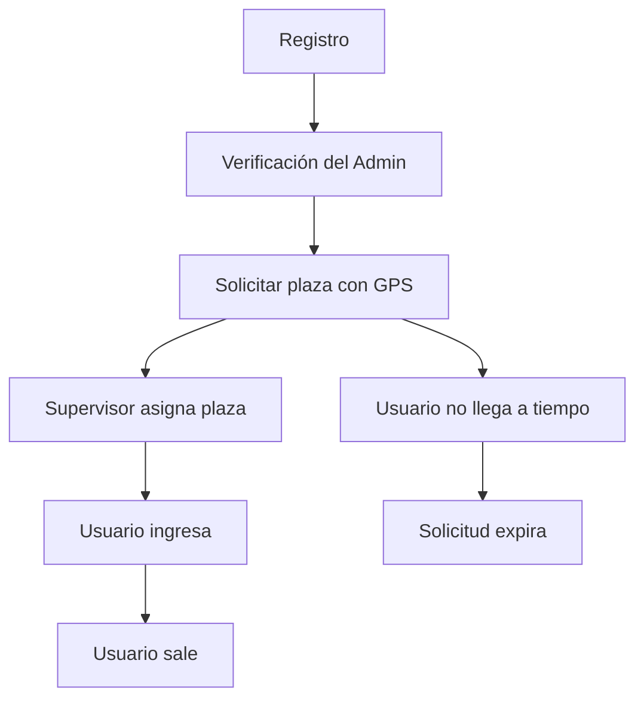

# UTP Parking — Sistema de Gestión de Estacionamiento

**Curso:** Proyecto Curso Integrador  
**Autores:** RustyGondolier, Chance-test, GPAN18, rodri2626, rodricmercer-arch  
**Repositorio:** https://github.com/RustyGondolier/Proyecto-CursoIntegrador

Sistema web para la gestión y control de estacionamientos en la Universidad Tecnológica del Perú (UTP). Permite a estudiantes y docentes solicitar plazas de estacionamiento, a supervisores controlar el flujo de ingreso y salida, a administradores gestionar cuentas y a dirección visualizar métricas y reportes analíticos.

---

## Índice

1. [Requerimientos del Sistema](#1-requerimientos-del-sistema)
2. [Roles del sistema](#2-roles-del-sistema)
3. [Flujo principal](#3-flujo-principal)
4. [Arquitectura](#4-arquitectura)
5. [Tecnologías y justificación](#5-tecnologías-y-justificación)
6. [Base de datos](#6-base-de-datos)
7. [API REST](#7-api-rest)
8. [Funcionalidades implementadas](#8-funcionalidades-implementadas)
9. [Limitaciones y aspectos no implementados](#9-limitaciones-y-aspectos-no-implementados)
10. [Instalación y configuración](#10-instalación-y-configuración)
11. [Conclusiones y trabajo futuro](#11-conclusiones-y-trabajo-futuro)

---

## 1. Requerimientos del Sistema

El sistema se desarrolló en base a los siguientes **22 requerimientos funcionales (RF)** documentados con casos de uso detallados (precondiciones, flujo, excepciones, postcondiciones y criterios de aceptación) en el siguiente enlace:

[📋 Casos específicos de uso — Google Sheets](https://docs.google.com/spreadsheets/d/1_WkyuloJYl4mqfe0fGwjRaXTl4LEZGpB/edit?usp=sharing&ouid=109077063996463709996&rtpof=true&sd=true)

| ID | Nombre | Descripción |
|---|---|---|
| RF01 | Registro de usuario | El sistema permite que un nuevo usuario cree su cuenta ingresando sus datos personales, del vehículo y de su licencia para acceder al servicio de solicitud de plaza. |
| RF02 | Inicio de sesión | El sistema permite que un usuario registrado acceda a la plataforma mediante su código institucional y contraseña. |
| RF03 | Gestión de perfil de usuario | El sistema permite al usuario visualizar y modificar sus datos personales. Al modificar cualquier dato, el estado de verificación del perfil vuelve a "pendiente". |
| RF04 | Cierre de sesión | El sistema permite al usuario cerrar su sesión de forma segura desde cualquier sección de la plataforma. |
| RF05 | Gestión de datos del vehículo | El sistema permite al usuario registrar, visualizar y modificar los datos de su vehículo (placa y modelo). |
| RF06 | Dashboard principal con contadores | El sistema muestra al usuario un panel con los contadores en tiempo real de cada cochera: total de plazas disponibles y ocupadas para autos y motos. |
| RF07 | Solicitud de acceso a estacionamiento | El usuario solicita una plaza desde la app cuando se encuentra a menos de 2.5 km de la universidad. |
| RF08 | Cancelación de solicitud activa | El sistema permite al usuario cancelar su solicitud antes de que el supervisor confirme el ingreso físico. |
| RF09 | Visualización del mapa del estacionamiento | El sistema permite al usuario visualizar el mapa de cada cochera con la distribución y rutas. |
| RF10 | Registro oficial de ingreso a cochera | El supervisor confirma el ingreso físico del vehículo a la cochera buscando su placa en el sistema. |
| RF11 | Registro de salida del vehículo | El supervisor registra la salida física del vehículo de la cochera. |
| RF12 | Búsqueda de usuario por placa | El sistema permite al supervisor buscar a un usuario ingresando la placa de su vehículo. |
| RF13 | Gestión de reportes de incidencias (supervisor) | El supervisor revisa los reportes de incidencia enviados por los usuarios y los resuelve o escala a prioritarios. |
| RF14 | Registro de infracciones | El supervisor registra infracciones observadas asociándolas al usuario mediante la placa del vehículo. |
| RF15 | Verificación de datos de usuario | El administrador verifica que la información ingresada por el usuario sea correcta y aprueba o suspende el perfil. |
| RF16 | Suspensión y reactivación de cuenta | El administrador puede suspender temporalmente o reactivar la cuenta de un usuario. |
| RF17 | Gestión de infracciones (administrador) | El administrador revisa el historial completo de infracciones y puede tomar medidas como la suspensión. |
| RF18 | Revisión de reportes prioritarios (administrador) | El administrador recibe y gestiona los reportes marcados como prioritarios por el supervisor. |
| RF19 | Reporte de incidencias (usuario) | El usuario puede reportar un problema en su plaza asignada para que el supervisor tome acción. |
| RF20 | Historial de accesos del usuario | El sistema permite al usuario consultar su historial completo de accesos al estacionamiento. |
| RF21 | Sección de ayuda y preguntas frecuentes | El sistema provee una sección de ayuda con preguntas frecuentes para orientar a usuarios nuevos. |
| RF22 | Dashboard de métricas para Dirección | El sistema provee a la Dirección un panel con gráficas de uso del estacionamiento. |

Además, se definieron **8 requerimientos no funcionales** (RNF01–RNF08) que cubren geolocalización en tiempo real, actualización de contadores vía WebSocket, cancelación automática por temporizador, disponibilidad del sistema, diseño responsivo, seguridad por roles, tiempo de respuesta e integridad de datos ante fallos.

---

## 2. Roles del sistema

| Rol | Usuarios | Funciones principales |
|---|---|---|
| **Usuario** | Estudiantes y docentes | Registro con correo institucional, gestión de vehículos, solicitar plaza de estacionamiento, ver historial, reportar incidencias, consultar FAQ |
| **Supervisor** | Personal de control de estacionamiento | Dashboard de control, buscar vehículos por placa, asignar plazas, confirmar ingreso, registrar salida, gestionar incidencias, registrar infracciones |
| **Administrador** | Personal administrativo | Dashboard de gestión, verificar cuentas nuevas, suspender y reactivar usuarios, gestionar infracciones, resolver reportes prioritarios |
| **Dirección** | Alta dirección universitaria | Dashboard analítico con gráficos de ocupación por día/semana/hora, flujo de ingresos, permanencia promedio, reportes por estacionamiento, exportación a Excel |

### Limitaciones por rol

- **Usuario:** solo puede tener una solicitud activa a la vez. Debe estar verificado y estar ubicado dentro del campus (≤2500 m) para solicitar una plaza. La solicitud expira a los 30 minutos si no se confirma el ingreso. No puede cancelar si el supervisor ya confirmó el ingreso.
- **Supervisor:** solo puede asignar plazas disponibles. Debe confirmar ingreso dentro del tiempo límite de la solicitud. Opera sobre un estacionamiento específico.
- **Administrador:** solo puede verificar cuentas con `requiere_reverificacion = true`. Las suspensiones requieren un motivo.
- **Dirección:** solo visualiza datos; no puede realizar operaciones sobre usuarios o solicitudes.

---

## 3. Flujo principal



### Secuencia detallada

1. **Registro:** el usuario se registra con código universitario, correo `@utp.edu.pe`, licencia de conducir y datos del vehículo. El sistema valida formato de placa (ABC-123 o AB-1234), vigencia de licencia y unicidad de datos.
2. **Verificación:** un administrador revisa los datos del nuevo usuario y lo verifica. Sin verificación, el usuario no puede solicitar plazas.
3. **Solicitud:** el usuario selecciona un estacionamiento y su navegador envía las coordenadas GPS. El sistema calcula la distancia al campus (fórmula Haversine). Si está dentro del radio permitido (2500 m), se crea la solicitud con estado `pendiente` y un temporizador de 30 minutos.
4. **Asignación:** el supervisor ve las solicitudes pendientes en su dashboard, busca al usuario por placa o código, selecciona una plaza disponible y la asigna.
5. **Ingreso:** el supervisor confirma el ingreso físico del vehículo. La plaza pasa a `ocupada` y la solicitud a `ingresado`. Se genera un código identificador.
6. **Salida:** el supervisor registra la salida. La plaza se libera (vuelve a `disponible`), la solicitud pasa a `finalizado` y se calcula el tiempo de permanencia.

### Flujo alternativo — Infracción

Durante la estadía, un supervisor puede registrar una infracción asociada a la placa del vehículo (mal estacionado, pérdida de identificador, obstrucción, etc.). Esto suma puntos de infracción al usuario.

### Flujo alternativo — Incidencia

El usuario puede reportar una incidencia (choque, robo, problema con la plaza). El reporte pasa por estados: `enviado` → `en_revision` → `resuelto`. Los reportes pueden marcarse como `prioritarios` para que un administrador los atienda.

---

## 4. Arquitectura

El sistema sigue una arquitectura MVC extendida con capas adicionales para separar responsabilidades:

```
┌──────────┐     ┌────────────┐     ┌────────────┐     ┌───────────┐     ┌────────────┐
│  Route   │────▶│ Middleware │────▶│ Controller │────▶│  Service  │────▶│ Repository │
│(Express) │     │(auth, role)│     │  (thin)    │     │(business) │     │   (SQL)    │
└──────────┘     └────────────┘     └────────────┘     └───────────┘     └────────────┘
                                                                              │
                                                                       ┌──────▼──────┐
                                                                       │ PostgreSQL  │
                                                                       │   (Neon)    │
                                                                       └─────────────┘
```

### Capas

| Capa | Ubicación | Responsabilidad |
|---|---|---|
| **Route** | `src/routes/` | Define los endpoints HTTP y conecta con middlewares y controllers |
| **Middleware** | `src/middleware/` | Autenticación JWT, verificación de roles |
| **Controller** | `src/controllers/` | Capa delgada que recibe el request y llama al service correspondiente |
| **Service** | `src/services/` | Lógica de negocio, validaciones, reglas, orquestación |
| **Repository** | `src/repositories/` | Consultas SQL a la base de datos |
| **DB** | `db/` | Pool de conexión a PostgreSQL, schema, seeds |

### Justificación de la arquitectura

- **Separación de preocupaciones:** cada capa tiene una responsabilidad única, facilitando el mantenimiento y las pruebas.
- **Service layer:** centraliza la lógica de negocio, evitando que los controladores crezcan y se mezclen con reglas de dominio.
- **Repository pattern:** aísla las consultas SQL, permitiendo cambiar de ORM o base de datos sin afectar la lógica de negocio.
- **Sin framework de frontend:** se optó por vanilla JS para mantener el proyecto liviano y enfocado en la funcionalidad del backend. Chart.js se usa exclusivamente para gráficos.

### Comunicación en tiempo real

Socket.IO se utiliza para:

- Notificar cambios de ocupación a todos los clientes (`ocupacion:updated`)
- Notificar al usuario cuando se le asigna una plaza (`plaza:asignada`)
- Notificar al usuario cuando se registra su salida (`salida:registrada`)
- Enviar notificaciones en tiempo real (`notificacion:nueva`)

---

## 5. Tecnologías y justificación

| Capa | Tecnología | Versión | Justificación |
|---|---|---|---|---|
| Backend | Node.js | ≥18 | Entorno JavaScript del lado del servidor, mismo lenguaje que el frontend, ideal para prototipado rápido |
| Framework web | Express | ^5.2.1 | Framework minimalista, flexible, ampliamente documentado |
| Base de datos | PostgreSQL (Neon) | 16 | Base relacional con soporte transaccional, JSONB, ventanas. Neon ofrece serverless PostgreSQL |
| Tiempo real | Socket.IO | ^4.8.3 | Comunicación bidireccional con fallback a polling, salas por usuario |
| Autenticación | JWT | ^9.0.3 | Tokens stateless, sin sesiones en servidor |
| | bcryptjs | ^3.0.3 | Hash seguro de contraseñas |
| Logging | Winston | ^3.19.0 | Logging estructurado con múltiples transportes (archivo + consola) |
| Seguridad | Helmet | ^8.1.0 | Headers HTTP de seguridad (CSP, X-Frame-Options, etc.) |
| | CORS | ^2.8.6 | Control de acceso cruzado |
| | express-rate-limit | ^8.5.2 | Rate limiting (1000 req/15min global, 10 login/15min) |
| Frontend | HTML5 + CSS3 + Vanilla JS | — | Sin dependencias pesadas, carga rápida, suficiente para el alcance |
| Gráficos | Chart.js | ^4.5.1 | Liviano, sin dependencias, gran variedad de tipos de gráfico |
| Exportación | xlsx | ^0.18.5 | Generación de archivos Excel desde el servidor |

---

## 6. Base de datos

**Motor:** PostgreSQL 16 sobre Neon (serverless)  
**Esquema:** 20 tablas + 5 vistas  
**Archivo:** `db/schema.sql`

### Tablas por módulo

| Módulo | Tablas |
|---|---|
| **Catálogos** | `sedes`, `tipos_vehiculo`, `tipos_plaza`, `tipos_infraccion`, `estados_reporte`, `tipos_notificacion`, `faq_categorias` |
| **Núcleo** | `usuarios`, `vehiculos`, `estacionamientos`, `bloques`, `plazas` |
| **Operaciones** | `solicitudes_estacionamiento`, `verificaciones_ubicacion` |
| **Control** | `infracciones`, `reportes_incidencias`, `historial_accesos` |
| **Gestión** | `notificaciones`, `acciones_administrativas`, `faq` |

### Vistas analíticas

| Vista | Propósito |
|---|---|
| `v_ocupacion_actual` | Plazas totales vs ocupadas por estacionamiento y tipo |
| `v_flujo_por_hora` | Total de ingresos agrupados por hora del día |
| `v_permanencia_promedio` | Tiempo promedio de estadía en minutos |
| `v_usuarios_reincidentes` | Usuarios con infracciones (ordenados por cantidad) |
| `v_reportes_por_estacionamiento` | Total de reportes agrupados por estacionamiento |

### Restricciones importantes

- Índice único parcial `una_solicitud_activa` sobre `solicitudes_estacionamiento(usuario_id)` donde estado es `pendiente` o `ingresado` — garantiza que un usuario tenga solo una solicitud activa.
- `CHECK` en `usuarios.rol` y `usuarios.estado_cuenta` para valores controlados.
- `CHECK` en `plazas.estado` y `solicitudes_estacionamiento.estado`.

---

## 7. API REST

### Auth

| Método | Ruta | Descripción |
|---|---|---|
| POST | `/api/auth/login` | Inicio de sesión (rate limit: 10 intentos/15min) |
| POST | `/api/auth/register` | Registro de nuevo usuario |

### Usuario

| Método | Ruta | Descripción |
|---|---|---|
| GET | `/api/usuarios/perfil` | Obtener perfil del usuario autenticado |
| PUT | `/api/usuarios/perfil` | Actualizar perfil |
| GET | `/api/usuarios/vehiculos` | Listar vehículos del usuario |
| POST | `/api/usuarios/vehiculos` | Registrar nuevo vehículo |

### Solicitudes

| Método | Ruta | Descripción |
|---|---|---|
| POST | `/api/solicitudes` | Crear solicitud (requiere geolocalización) |
| GET | `/api/solicitudes/activa` | Obtener solicitud activa del usuario |
| POST | `/api/solicitudes/cancelar` | Cancelar solicitud (solo si está pendiente) |
| GET | `/api/solicitudes/historial` | Historial de solicitudes del usuario |

### Supervisor

| Método | Ruta | Descripción |
|---|---|---|
| GET | `/api/supervisor/dashboard` | Dashboard del supervisor |
| GET | `/api/supervisor/buscar/:placa` | Buscar vehículo por placa |
| GET | `/api/supervisor/solicitud/:id` | Buscar solicitud por ID |
| GET | `/api/supervisor/plazas-disponibles` | Plazas disponibles por estacionamiento y tipo |
| POST | `/api/supervisor/asignar-plaza` | Asignar plaza a una solicitud |
| POST | `/api/supervisor/confirmar-ingreso` | Confirmar ingreso del vehículo |
| POST | `/api/supervisor/registrar-salida` | Registrar salida del vehículo |
| GET | `/api/supervisor/buscar-identificador` | Buscar solicitud por código identificador |

### Infracciones

| Método | Ruta | Descripción |
|---|---|---|
| GET | `/api/infracciones/tipos` | Obtener tipos de infracción |
| POST | `/api/infracciones` | Registrar infracción |
| GET | `/api/infracciones` | Listar infracciones |

### Reportes

| Método | Ruta | Descripción |
|---|---|---|
| POST | `/api/reportes` | Crear reporte de incidencia |
| GET | `/api/reportes` | Listar reportes del usuario |

### Administrador

| Método | Ruta | Descripción |
|---|---|---|
| GET | `/api/administrador/dashboard` | Dashboard del administrador |
| GET | `/api/administrador/usuarios-pendientes` | Usuarios pendientes de verificación |
| POST | `/api/administrador/verificar` | Verificar usuario |
| POST | `/api/administrador/suspender` | Suspender usuario |
| POST | `/api/administrador/reactivar` | Reactivar usuario |

### Dirección

| Método | Ruta | Descripción |
|---|---|---|
| GET | `/api/direccion/dashboard` | Dashboard analítico con gráficos |
| GET | `/api/direccion/exportar/solicitudes` | Exportar solicitudes a Excel |
| GET | `/api/direccion/exportar/ocupacion` | Exportar datos de ocupación a Excel |

### Notificaciones / FAQ

| Método | Ruta | Descripción |
|---|---|---|
| GET | `/api/notificaciones` | Listar notificaciones del usuario |
| PUT | `/api/notificaciones/:id/leer` | Marcar notificación como leída |
| GET | `/api/faq` | Listar preguntas frecuentes |

---

## 8. Funcionalidades implementadas

- **Registro de usuarios** con validación de correo institucional (`@utp.edu.pe`), formato de placa (ABC-123 / AB-1234), vigencia de licencia, unicidad de datos
- **Autenticación** con JWT y rate limiting por IP
- **Control de acceso por roles** (middleware que verifica el rol del JWT)
- **Geolocalización** para solicitar plaza (fórmula Haversine, radio configurable por sede, actualmente 2500 m)
- **Temporizador de ingreso** (configurable, default 30 minutos) con expiración automática
- **Asignación manual de plazas** por el supervisor
- **Confirmación de ingreso** con código identificador (ej: A-01)
- **Registro de salida** con liberación automática de la plaza
- **Infracciones** asociadas a vehículos y usuarios, con tipos predefinidos
- **Reporte de incidencias** con flujo de estados (enviado → en_revisión → resuelto / prioritario)
- **Verificación de cuentas** por administrador (flujo de aprobación)
- **Suspensión y reactivación** de cuentas
- **Dashboard analítico** para dirección con gráficos de ocupación por día, semana y hora; flujo de ingresos; permanencia promedio; reportes por estacionamiento
- **Exportación a Excel** de reportes y datos de ocupación
- **Notificaciones en tiempo real** vía Socket.IO (cambios de ocupación, asignación de plaza, registro de salida)
- **Sección de FAQ** con categorías
- **Logging** de errores y eventos en archivos (Winston)
- **Middleware global de manejo de errores** con logging estructurado (Winston)
- **Función Haversine centralizada** en `src/utils/distance.js`
- **Manejo de errores con logging** en lugar de `catch` silenciosos (backend y frontend)
- **Migración de JWT a cookies httpOnly** eliminando la exposición del token en localStorage
- **Protecciones de seguridad:** Helmet, CORS, rate limiting
- **Persistencia de accesos:** historial de inicios de sesión exitosos y fallidos
- **Centralización de constantes** en `src/config/constants.js` con 10 grupos (ROLES, estados, tipos) usando `Object.freeze()` para evitar mutaciones accidentales

---

## 9. Limitaciones y aspectos no implementados

### Funcional (archivos vacíos o sin implementar)

| Archivo | Problema |
|---|---|
| `src/services/geolocation.service.js` | La lógica de geolocalización está inline en `solicitud.service.js` |
| `src/services/websocket.service.js` | No hay un servicio centralizado para WebSockets |
| `src/sockets/dashboard.socket.js` | Eventos Socket.IO del dashboard sin implementar |
| `src/sockets/notification.socket.js` | Eventos Socket.IO de notificaciones sin implementar |
| `src/sockets/solicitud.socket.js` | Eventos Socket.IO de solicitudes sin implementar |
| `src/utils/response.js` | No hay helpers estandarizados de respuesta HTTP |
| `src/utils/validators.js` | No hay validadores reutilizables |
| `public/shared/js/constants.js` | Las constantes del frontend (~54 strings) aún no se centralizan (pendiente para Fase 5 con Vite) |
| `public/shared/js/helpers.js` | Utilidades frontend sin implementar |

### Técnicas

| Limitación | Descripción |
|---|---|
| **Sin tests automatizados** | No existe ningún test unitario, de integración o end-to-end |
| **Sin linter ni formatter** | No hay ESLint ni Prettier; el estilo del código es inconsistente |
| **Sin CI/CD** | No hay pipeline de integración o despliegue automatizado |
| **Sin migraciones de BD** | Los cambios al esquema se aplican mediante scripts SQL manuales |
| **Sin HTTPS** | El servidor no tiene configuración de TLS; depende del proxy (Heroku) |
| **Sin bundler en frontend** | El JavaScript y CSS se sirven como archivos sueltos sin empaquetar |
| **Índices de BD incompletos** | Varias foreign keys en tablas grandes (`solicitudes_estacionamiento`, `infracciones`, `notificaciones`) carecen de índices |
| **Validación ad-hoc** | No hay middleware de validación (express-validator, Joi, Zod); las validaciones están dispersas en los servicios |
| **Socket.IO CORS en `'*'`** | El CORS de Socket.IO está abierto a cualquier origen |
| **Express 5** | Se usa Express v5 que tiene breaking changes respecto a v4 (manejo de errores asíncronos diferente) |

---

## 10. Instalación y configuración

### Requisitos previos

- Node.js >= 18
- pnpm
- Cuenta en Neon (PostgreSQL serverless) o PostgreSQL local

### Pasos

```bash
# 1. Clonar el repositorio
git clone https://github.com/RustyGondolier/Proyecto-CursoIntegrador.git
cd Proyecto-CursoIntegrador

# 2. Instalar dependencias
pnpm install

# 3. Configurar variables de entorno
cp .env.example .env
# Editar .env con los valores correctos (DATABASE_URL, JWT_SECRET, etc.)

# 4. Inicializar la base de datos
# Ejecutar db/schema.sql en tu instancia de PostgreSQL
psql $DATABASE_URL -f db/schema.sql

# 5. Sembrar datos iniciales
pnpm run seed

# 6. Iniciar en desarrollo
pnpm run dev
```

### Variables de entorno

| Variable | Descripción | Valor por defecto |
|---|---|---|
| `DATABASE_URL` | Cadena de conexión a PostgreSQL | — |
| `JWT_SECRET` | Clave secreta para firmar tokens JWT | — |
| `PORT` | Puerto del servidor | `3000` |
| `FRONTEND_URL` | Origen permitido para CORS | `http://localhost:3000` |
| `TIEMPO_LIMITE_INGRESO_MIN` | Minutos para ingresar después de solicitar | `30` |
| `RATE_LIMIT_WINDOW_MIN` | Ventana de rate limiting en minutos | `15` |
| `RATE_LIMIT_GLOBAL_MAX` | Máximo de peticiones global por ventana | `200` |
| `RATE_LIMIT_LOGIN_MAX` | Máximo de intentos de login por ventana | `10` |
| `LOG_LEVEL` | Nivel de logging (`debug`, `info`, `warn`, `error`) | `info` |

### Scripts disponibles

| Comando | Descripción |
|---|---|
| `pnpm run dev` | Iniciar servidor con nodemon (recarga automática) |
| `pnpm start` | Iniciar servidor en producción |
| `pnpm run seed` | Poblar base de datos con datos iniciales (sedes, usuarios, plazas) |

---

## 11. Conclusiones y trabajo futuro

### Conclusiones

- Se implementaron **22 requerimientos funcionales** cubriendo el ciclo completo del estacionamiento: registro, solicitud con geolocalización, asignación, ingreso, salida, infracciones, reportes, dashboards y exportación de datos.
- La arquitectura MVC con capas Service y Repository permitió separar responsabilidades, manteniendo los controladores delgados y la lógica de negocio centralizada.
- PostgreSQL sobre Neon proporciona una base de datos relacional serverless sin necesidad de administrar servidores, con 20 tablas y 5 vistas analíticas.
- Socket.IO habilita la actualización en tiempo real de contadores de ocupación y notificaciones sin recargar la página.
- La geolocalización (fórmula Haversine) restringe las solicitudes a usuarios dentro del campus (radio configurable de 2500 m).
- El sistema implementa medidas básicas de seguridad: autenticación JWT por roles (4 roles), Helmet, CORS y rate limiting.

### Trabajo futuro

- [x] **Centralizar constantes** del backend en `src/config/constants.js`
- [ ] **Implementar validadores:** express-validator o Zod para validación de inputs
- [ ] **Agregar tests:** Jest + Supertest para tests de integración de la API.
- [x] **Mejorar seguridad:** migrar JWT de localStorage a httpOnly cookies.
- [ ] **Agregar linter/formatter:** ESLint + Prettier con configuración estandarizada.
- [ ] **Migraciones de BD:** usar Knex o similar para versionar el esquema.
- [ ] **CI/CD:** GitHub Actions para correr tests y linter en cada push.
- [ ] **Optimizar BD:** agregar índices a foreign keys más consultadas.
- [ ] **Empaquetar frontend:** considerar Vite para bundling y minificación.
- [x] **Mejorar manejo de errores:** reemplazar `catch (_) {}` con logging estructurado.
- [ ] **TypeScript:** migrar el proyecto a TypeScript para mayor seguridad de tipos.
